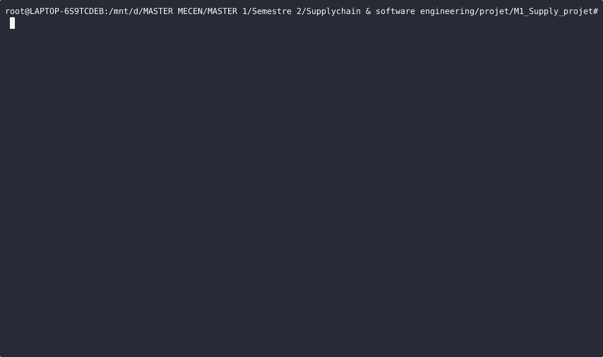

# optimisation-effectif
[](https://www.python.org/)
[](https://docs.pydantic.dev/)
[](https://github.com/astral-sh/ruff)

>**Planification optimale des effectifs pour minimiser les coûts tout en respectant les contraintes opérationnelles.**

## Problème
Ce projet résout un [problème de planification des effectifs](https://github.com/MECEN-TOURS/SC-2025-2026/tree/main/projets/10) :

À partir de :
- besoins mensuels en personnel
- coûts d’embauche et de réduction d’effectif
- pénalités en cas de sureffectif ou sous-effectif

Il calcule la stratégie optimale minimisant le coût total.

---
## Fonctionnalités

- 📊 Planification optimale des effectifs
- ⚡ Résolution efficace via un graphe acyclique (plus court chemin)
- 🧩 Modélisation robuste avec Pydantic v2
- 🖥️ Interface CLI (Typer + Rich)
- 🌐 Visualisation via un dashboard interactif


---
## Démonstration

### via la CLI

**Exécution complète du workflow (génération → visualisation → résolution) :**



---
## Prérequis

- Python 3.13+
- uv (recommandé)

---
## Installation
```bash
git clone <url-du-repo>
cd optimisation-effectif
uv sync
```

---

## Utilisation

### Web Service

[DASHBOARD INTERACTIF hébergé](https://m1-supply-projet.onrender.com/)

### Python

```python
from optimisation_effectif import ProblemeDeploiement, resoudre

probleme = ProblemeDeploiement(
    mois=["Janvier", "Fevrier", "Mars", "Avril", "Mai", "Juin",
          "Juillet", "Aout", "Septembre"],
    besoins={"Mars": 4, "Avril": 6, "Mai": 7, "Juin": 4, "Juillet": 6, "Aout": 2},
    effectif_initial=3,
    effectif_final=3,
    effectif_max=30,
    cout_changement=160,
    cout_ecart=200,
    limite_heures_sup=0.25,
    echanges_max_absolu=3,
    fraction_echanges_max=1 / 3,
)

solution = resoudre(probleme)
print(solution.cout_total)   # 2160.0
```

### CLI

```bash
# Générer un fichier JSON exemple
uv run python -m optimisation_effectif.interfaces demo

# Visualiser le problème
uv run python -m optimisation_effectif.interfaces view demonstration.json

# Résoudre
uv run python -m optimisation_effectif.interfaces solve demonstration.json
```

### Interactive dashboard

```bash
uv run python dashboard.py
```

## Structure

```text
optimisation_effectif/
├── models.py        # Modèles Pydantic — ProblemeDeploiement, SolutionDeploiement
├── costs.py         # Calcul des coûts et validations
├── graph.py         # Construction du DAG (NetworkX)
├── solver.py        # Résolution par Bellman-Ford
├── interfaces/      # CLI Typer + Rich
└── Dashboard/       # Dashboard interactif
```


---
## Principe

Le problème est modélisé comme un graphe orienté acyclique (DAG) :

- Chaque nœud représente un effectif à un mois donné
- Chaque arête représente une transition (embauche, réduction, maintien)
- Un coût est associé à chaque transition

La solution optimale correspond au plus court chemin dans ce graphe,
calculé avec l’algorithme de Bellman-Ford.

---
## Développement

```bash
uv sync --group dev
pytest
ruff check .
```
---
## Licence

**CC-BY-SA - Master MECEN 2025-2026**

Projet développé dans le cadre du Master Mecen de l'Université de Tours.